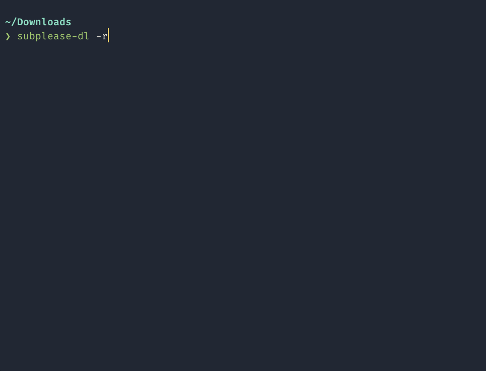

# subplease-dl
Search and download anime from subplease.org

## Demo


## Requirements
`curl`, `perl`,
[`coreutils`](https://www.gnu.org/software/coreutils/),
[`fzf`](https://github.com/junegunn/fzf)
(or [`rofi`](https://github.com/davatorium/rofi)),
[`jq`](https://github.com/stedolan/jq),

## Install

Copy or symlink [subplease-dl](subplease-dl) to PATH

## Usage
```
subplease-dl [OPTIONS]

Options:
  -r, --recent                  Search for recent epsisodes
  -s, --search                  Search anime by name
  -t, --time                    Print airtime schedule
  -h, --help                    Print Usage
```
Default option: `--recent`
